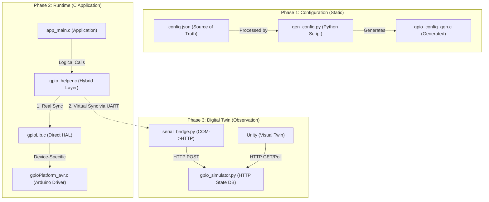

# GPIO Driver Ecosystem Architecture

This document describes the multi-layered architecture of the HAL-based GPIO driver, including its automated configuration workflow and Digital Twin synchronization.

## 1. High-Level System Flow

The ecosystem operates on a **Triple-Sync** principle: Configuration Sync, Hardware Sync, and Digital Twin Sync.



---

## 2. Layered Software Stack

The C codebase is organized into four distinct layers to ensure hardware portability and simulation transparency.

| Layer | Responsibility | Key Files |
| :--- | :--- | :--- |
| **Helper Layer** | **Multi-Source Coordinator**. Handles the simultaneous driving of physical hardware AND sending telemetry to the Digital Twin bridge. | `gpio_helper.c`, `helper_common.c` |
| **Library (HAL)** | **Interface Layer**. Provides the generic `vHalRegisterGpioInterface` mechanism. Dispatches calls to the currently active platform. | `gpioLib.c`, `gpioLib.h` |
| **Platform Adapter** | **Runtime Glue**. Binds the HAL to the platform and sets up board-level requirements (like UART for logging). | `platform_adapter.c` |
| **Implementation** | **Hardware Driver**. Performs direct register-level manipulation of the MCU. | `gpioPlatform_avr.c`, `gpioLib_http.c` |

---

## 3. Configuration Management

We avoid hardcoding pin numbers in C. The `config.json` is the **Single Source of Truth**.

1.  **JSON**: Defines logical name, pin index (e.g., `5`), and direction.
2.  **Generator**: `gen_config.py` iterates through the JSON and generates a static array of `sGpioConfig_t` structures.
3.  **Binding**: The implementation initialization (`vGpioAVRInit`) loops through this generated array to configure the MCU's `DDR` and `PORT` registers.

---

## 4. Digital Twin Synchronization

The Digital Twin does **not** simulate the AVR CPU; it simulates the **environment state**.

-   **Telemetry Format**: The AVR sends minimal JSON over Serial: `{"t":"GPIO","p":"LED1","v":1}`.
-   **Bridging**: `serial_bridge.py` acts as a non-intrusive observer. It does not affect hardware timing.
-   **Interaction**: You can manually trigger "Inputs" (like Button presses) by sending HTTP POSTs to the Simulator, which the AVR can then read back.

---

## 5. Directory Structure

```text
gpio_driver/
├── config/              # Configuration logic
├── examples/
│   ├── avr/             # Hardware example (CMake, building, flashing)
│   ├── pc/              # Sim-only example
│   └── common/          # Shared logic (The actual app)
├── helpers/             # Hybrid Helper layer
├── implementations/
│   ├── avr/             # Physical device drivers
│   └── pc/              # HTTP simulator client
├── scripts/             # Python automation (Code generators)
├── simulator/           # Digital Twin backend
└── gpio_digital_twin/   # Unity project (Digital Twin frontend)
```
