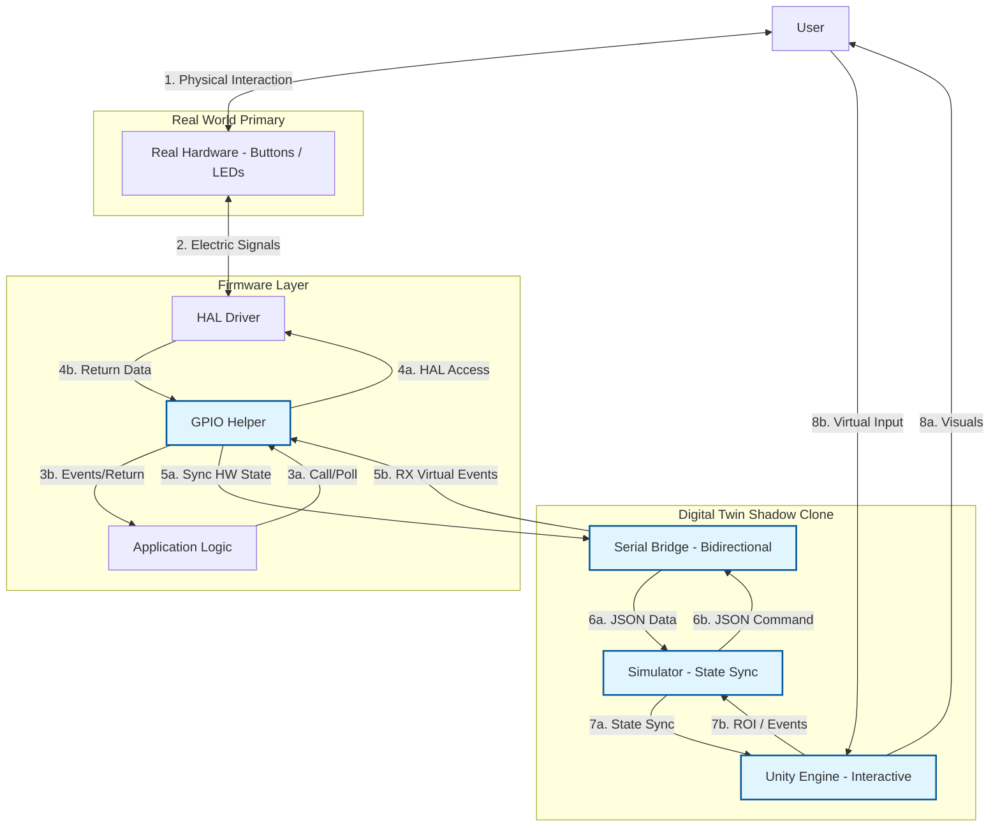
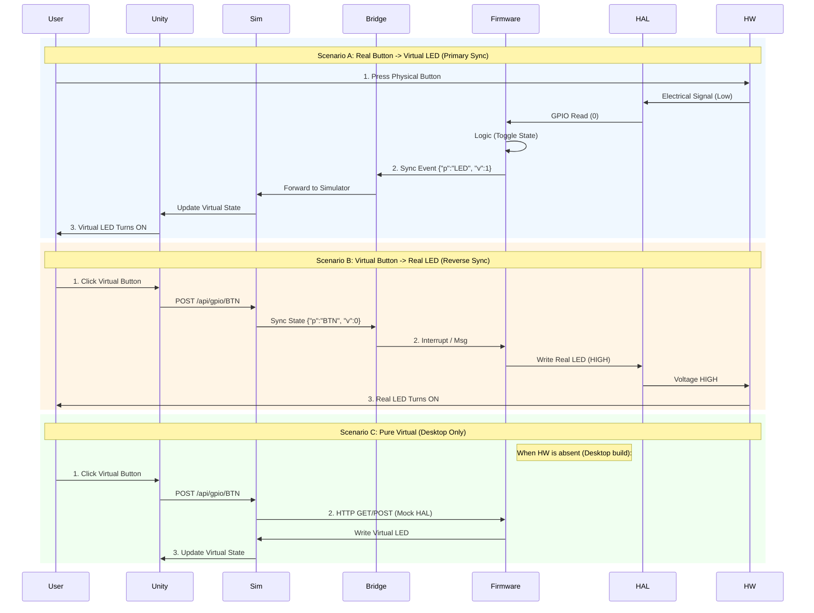

# HAL Drivers Repository Analysis

## Executive Summary
The `hal_drivers` repository is a modular **Executable HAL + Digital Twin Framework for Embedded Systems**. It is designed to decouple hardware abstraction from business logic, allowing for hardware-free onboarding, architecture validation, and deterministic testing.

Its primary innovation is the **"Digital Twin"** architecture, which allows embedded C code to run identical logic on:
1.  Real Hardware (STM32, Arduino, AVR).
2.  Desktop Simulators (Windows/Linux via HTTP).
3.  Digital Twin Visualizations (Unity).

This analysis focuses on the **GPIO Driver** as the "Gold Standard" implementation, demonstrating the complete pipeline from C application to 3D visualization.

---

## Component Architecture

The system is composed of four distinct but integrated components:

### 1. The Driver Layer (Hardware Abstraction)
**Location:** `gpio_driver/`
*   **Core Interface:** `gpioLib.h` defines the standard API (`eHalGpioReadFunc`, `eHalGpioWriteFunc`).
*   **Implementations:**
    *   `implementations/gpioPlatform_arduino.h`: Direct register/library calls for Arduino.
    *   `implementations/gpioLib_http.h`: The **Simulator Bridge**. Instead of toggling physical pins, it sends JSON payloads via HTTP POST/GET to a local server.
*   **Key Concept:** The application code includes `gpioLib.h` and is agnostic to the underlying implementation (selected at compile time via macros like `PLATFORM_ARDUINO`).

### 2. The Application (Business Logic)
**Location:** `gpio_driver/examples/example_main.c`
*   **Role:** Represents the "firmware" running on the MCU.
*   **Logic:**
    *   Initializes the HAL.
    *   Polls `BUTTON1`.
    *   If `BUTTON1` changes state, it toggles `LED1`.
*   **Portability:** This exact C file compiles to an `.exe` on Windows (talking to the simulator) and a `.hex` on Arduino (talking to real pins).

### 3. The Simulator (State Management)
**Location:** `gpio_driver/simulator/gpio_simulator.py`
*   **Tech Stack:** Python 3 (No external dependencies, uses `http.server`).
*   **Role:** Acts as the "Virtual Microcontroller Memory".
*   **Mechanism:**
    *   Runs on `localhost:8080`.
    *   Maintains a JSON dictionary of pin states (`gpio_pins`).
    *   **Endpoints:**
        *   `POST /api/gpio/<pin>`: Used by the C App to set outputs (LEDs).
        *   `GET /api/gpio/<pin>`: Used by the C App to read inputs (Buttons) and by Unity to visualize state.
        *   `POST /api/gpio/<pin>/configure`: Sets direction (INPUT/OUTPUT).

### 4. The Visualization (Digital Twin/Unity)
**Location:** `gpio_driver/gpio_digital_twin/`
*   **Role:** Provides a photorealistic, interactive interface for the simulator.
*   **Key Scripts:**
    *   `VisualGPIOPin.cs`: Attached to 3D GameObjects.
        *   **Polling:** Periodically asks the Simulator (`GET`) for pin states.
        *   **Visual Binding:** Updates Material emission, Light intensity, or GameObject activation based on state.
        *   **Input Simulation:** Can send signals (`POST`) to the Simulator to simulate physical button presses.

### System Block Diagram

### System Block Diagram

The system uses a **Helper Layer** to ensure synchronization between the Real World and the Digital Twin.

---

## Data Flow Analysis

This architecture allows the **same Application Logic** to run in two completely different environments.

### Unified Data Flow Analysis
The following diagram illustrates all three interaction modes in a single view:
1.  **Real -> Virtual** (Physical Button triggers Virtual LED).
2.  **Virtual -> Real** (Unity Button triggers Real LED).
3.  **Pure Virtual** (Desktop-only workflow, where Hardware is emulated).

### Detailed Steps
1.  **Unity (User Action):** User clicks the 3D Button in Unity.
2.  **Unity (Script):** `VisualGPIOPin.cs` sends `POST /api/gpio/BUTTON1 {value: 0}` to the Python Simulator.
3.  **Simulator (State):** Python script updates `gpio_pins["BUTTON1"]` to `LOW`.
4.  **Application (Polling):** `example_main.c` (running in terminal) calls `psGpioInterface->eHalGpioReadFunc("BUTTON1")`.
5.  **Driver (HTTP):** `gpioLib_http.h` performs `GET /api/gpio/BUTTON1` and receives `0`.
6.  **Application (Logic):** Detects state change `HIGH -> LOW`. Toggles internal LED state `OFF -> ON`.
7.  **Application (Action):** Calls `psGpioInterface->eHalGpioWriteFunc("LED1", 1)`.
8.  **Driver (HTTP):** Sends `POST /api/gpio/LED1 {value: 1}` to Simulator.
9.  **Simulator (State):** Python script updates `gpio_pins["LED1"]` to `HIGH`.
10. **Unity (Polling):** `VisualGPIOPin.cs` polls `LED1` via `GET`.
11. **Unity (Visual):** Receives `1`. Enables the `LEDEmisison` material and Point Light.

**Result:** The user clicks a virtual button, the signal travels to a C program (simulating firmware), logic processes it, and the virtual LED lights up.

---

## Maturity & Scaling Roadmap

The **GPIO Driver** is the most mature component, serving as the "Gold Standard" for this architecture.

### Current Strengths
1.  **Complete Loop:** Implements the full cycle described above.
2.  **Structured Config:** Uses dependency injection for logging and platform selection.
3.  **Visualization:** Has a dedicated Unity project with scripts that handle both polling and writing.
4.  **Error Handling:** The Python simulator handles 404s and bad JSON gracefully.

### Architectural Roadmap (Review Recommendations)

To elevate this to a **Reference Architecture**, the following improvements are recommended:

#### 1. Contract Enforcement
*   **Strict Configuration:** The Driver should assert/fail if a pin is used before `configure()` is called.
*   **Direction Logic:** Prevent writing to INPUT pins or reading from uninitialized OUTPUT pins.

#### 2. Scalable Communication
*   **Server-Sent Events (SSE):** Replace polling with SSE or WebSockets for state updates. This is critical for scaling to high-frequency drivers like ADC or PWM and ensures lower latency.

#### 3. Pin Identity
*   **Pin Registry:** Implement a centralized pin registry (YAML/JSON) to map `LED1` to hardware aliases (`D13`, `PA5`) and remove visual-side auto-correction.

#### 4. Firmware Enhancements
*   **Debounce Abstraction:** Add software debouncing in the HAL or helper layer to demonstrate real-world robustness.
*   **HAL Versioning:** Add `#define HAL_GPIO_API_VERSION 1` to manage interface evolution.
