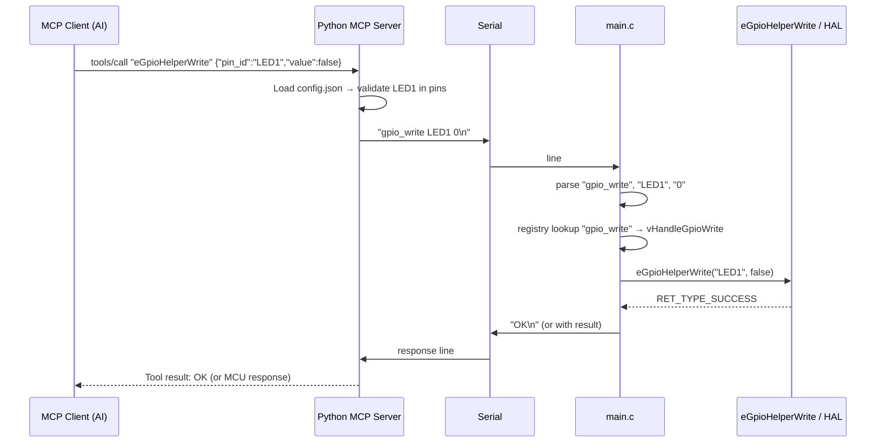

# HAL Embedded MCP Server – Architecture

We expose HAL operations to AI assistants via MCP. The **MCU** runs the real HAL (e.g. `eGpioHelperWrite`, `eGpioHelperRead`); it receives **tool invocations over UART** and dispatches them via a **registry**. The **Python MCP server** talks to the AI (MCP) and to the MCU (UART); it uses **config** (e.g. `config.json`) to know which functions exist and what their parameters are (e.g. pin names like `LED1`, `BUTTON1`).

---

## 1. Goals

- **MCU executes HAL**: All hardware actions run on the MCU. `main.c` receives commands over UART, looks up the function in a **registry**, and calls it (e.g. `eGpioHelperWrite("LED1", false)`).
- **Python = MCP only**: The Python process is the **MCP server** (tools + resources). It does **not** drive hardware itself; it forwards tool calls to the MCU over UART.
- **Config-driven parameters**: Pin names and other options come from config (e.g. `gpio_driver/examples/avr/config.json`). The Python server reads this to build MCP tool schemas (e.g. `pin_id` enum `["LED1", "BUTTON1"]`) and to send valid commands. The MCU uses the same config at build/runtime so names stay in sync.
- **Single source of truth**: Config (e.g. `config.json`) defines what exists; both Python (MCP tools + UART protocol) and MCU (registry + pin list) align to it.
- **One config, one script, two outputs**: One config file (e.g. `config.json`) and one generator script (like `gpio_driver/scripts/gen_config.py`) run at **build time** to generate **C** artifacts for the MCU and **Python** artifacts for the MCP server, so both sides stay in sync without duplicating config.

---

## 2. Single Config + Build-Time Code Generation

Same pattern as **gpio_driver**: one JSON config and a script that runs during build to generate different content for C and Python.

### 2.1 Source of truth: one config

- **Single config file** (e.g. `hal_embedded_mcp/config/config.json` or reuse/extend `gpio_driver/examples/avr/config.json`).
- Defines at least:
  - **Pins** (for GPIO tools): same shape as gpio_driver, e.g. `{"pins":[{"name":"LED1","direction":"OUTPUT",...},{"name":"BUTTON1",...}]}`.
  - Optionally: **tools** enabled (e.g. `gpio_write`, `gpio_read`), **uart** (port/baud), **mcp**-specific options.
- Both MCU and Python **never** hand-edit pin lists or tool lists; they use **generated** code/data from this config.

### 2.2 Generator script (run at build)

- **One script** (e.g. `hal_embedded_mcp/scripts/gen_mcp_from_config.py`) that:
  - Reads the single config (e.g. `config/config.json`).
  - Produces **C outputs** for the MCU build.
  - Produces **Python outputs** for the MCP server (or for the server to load at startup).

Pattern mirrors `gpio_driver/scripts/gen_config.py` and `gpio_driver/examples/avr/CMakeLists.txt` (add_custom_command to run the script before compile).

### 2.3 Generated outputs

| Output | Consumer | Content |
|--------|----------|--------|
| **C** (e.g. `mcu/build/mcp_pins_gen.c`) | MCU | Pin name table (e.g. `const char *g_apcMcpPinNames[] = { "LED1", "BUTTON1", NULL }`) for validation in handlers; optional: generated registry table if we want script to emit tool names. |
| **C** (e.g. `mcu/build/mcp_config_gen.c`) | MCU | Same idea as gpio: full pin config array if MCU shares the same hardware config (or include from gpio_config_gen.c). Can be a thin wrapper that includes driver-generated config. |
| **Python** (e.g. `server/generated/mcp_schema.py` or `mcp_schema.json`) | MCP server | Pin list for MCP tool schemas (e.g. `MCP_PIN_NAMES = ["LED1", "BUTTON1"]`), optional tool list and param schemas, so the server builds tools with correct enums/descriptions without parsing JSON at runtime. |

The script can emit one or more C files and one or more Python files; the important point is **one config in, many artifacts out** so C and Python never drift.

### 2.4 When the script runs

- **MCU build** (e.g. CMake): `add_custom_command(OUTPUT mcp_pins_gen.c COMMAND python scripts/gen_mcp_from_config.py config/config.json ... DEPENDS config.json gen_mcp_from_config.py)`, then add generated sources to the target (same as gpio_driver/examples/avr).
- **Python / MCP server build or install**: Run the same script (e.g. `python scripts/gen_mcp_from_config.py config/config.json --python-out server/generated/`) so `server/generated/` is populated before the server runs or before packaging.

Optional: a top-level `build.bat` / `build.sh` or CMake that runs the generator once and builds both MCU and server.

### 2.5 Example config shape (extensible)

```json
{
  "pins": [
    { "name": "LED1", "direction": "OUTPUT", "pull": "NONE", "avr": { "port": "B", "pin": 5 } },
    { "name": "BUTTON1", "direction": "INPUT", "pull": "UP", "avr": { "port": "B", "pin": 0 } }
  ],
  "mcp": {
    "tools": ["gpio_write", "gpio_read"],
    "uart": { "baud": 57600 }
  }
}
```

The generator reads `pins` and `mcp.tools` to emit C pin list (and optionally registry entries) and Python pin enum + tool list.

---

## 3. High-Level Architecture (Data Flow)

```
┌─────────────────────────────────────────────────────────────────────────┐
│  MCP Client (e.g. Claude Desktop, Cursor)                               │
│  tools/list → sees e.g. eGpioHelperWrite("pin", value)                   │
│  tools/call → e.g. eGpioHelperWrite("LED1", false)                       │
└────────────────────────────────┬────────────────────────────────────────┘
                                 │ MCP (stdio)
                                 ▼
┌─────────────────────────────────────────────────────────────────────────┐
│  Python MCP Server (hal_embedded_mcp)                                    │
│  - Exposes tools that mirror MCU registry (names + params from config)  │
│  - On tools/call: serialize command → send over UART to MCU             │
│  - Resources: e.g. hal://config (config.json), hal://state (from MCU)   │
└────────────────────────────────┬────────────────────────────────────────┘
                                 │ UART / Serial (e.g. COM3, 57600)
                                 ▼
┌─────────────────────────────────────────────────────────────────────────┐
│  MCU (main.c)                                                            │
│  - Loop: read UART → parse "tool name + params"                          │
│  - Registry: map name → handler (e.g. "gpio_write" → eGpioHelperWrite)  │
│  - Call handler with parsed params (e.g. eGpioHelperWrite("LED1", 0))   │
│  - Optionally send response back over UART                               │
└────────────────────────────────┬────────────────────────────────────────┘
                                 │
                                 ▼
┌─────────────────────────────────────────────────────────────────────────┐
│  HAL / Helper layer (existing)                                           │
│  eGpioHelperWrite("LED1", false), eGpioHelperRead("BUTTON1", &val), ...  │
└─────────────────────────────────────────────────────────────────────────┘
```

So: **AI → MCP (Python) → UART → MCU (main.c + registry) → HAL helpers**.

---

## 4. MCU Side (main.c + registry)

### 4.1 Role

- **Receive** tool invocations over UART (e.g. one command per line or one JSON object per line).
- **Parse** into: tool name (e.g. `gpio_write`) + parameters (e.g. `LED1`, `0`).
- **Dispatch** via a **registry**: table of `(name, handler)`. Handler is a C function that takes parsed args and calls the right HAL/helper (e.g. `eGpioHelperWrite("LED1", false)`).
- **Respond** over UART (optional): success/error or return value (e.g. for `gpio_read`).

### 4.2 Registry Design

- **Registry** = array or linked list of entries: `{ "gpio_write", vHandleGpioWrite }`, `{ "gpio_read", vHandleGpioRead }`, etc.
- Each **handler** signature is normalized so the main loop can call it the same way, e.g.  
  `void vHandleGpioWrite(const char *pcArgs);`  
  Inside the handler you parse `pcArgs` (e.g. `"LED1 0"`) and call `eGpioHelperWrite("LED1", false)`.
- **Adding a tool** = add one registry entry + one handler that parses args and calls the right helper (e.g. `eGpioHelperRead`, future sensor/ADC helpers).

Example (conceptual):

```c
// Registry entry type
typedef void (*vToolHandler_t)(const char *pcParams);

typedef struct {
    const char    *pcName;      // e.g. "gpio_write"
    vToolHandler_t pfHandler;
} sToolRegistryEntry_t;

// Handlers (implementations call existing HAL/helpers)
static void vHandleGpioWrite(const char *pcParams);  // parse "LED1 0" -> eGpioHelperWrite("LED1", false)
static void vHandleGpioRead(const char *pcParams);   // parse "LED1" -> eGpioHelperRead("LED1", &val), send result

static const sToolRegistryEntry_t g_asRegistry[] = {
    { "gpio_write", vHandleGpioWrite },
    { "gpio_read",  vHandleGpioRead },
    { NULL, NULL }
};

// Main loop: read line from UART -> "gpio_write LED1 0" -> find "gpio_write" -> vHandleGpioWrite("LED1 0")
```

Pin names (e.g. `LED1`, `BUTTON1`) come from the same config the firmware uses (e.g. generated from `config.json` or linked from a config table). The Python side uses the **same** config to build MCP tools and to send only valid pin names.

### 4.3 UART Protocol (MCU ↔ Python)

- **Downstream (Python → MCU)**: One command per line. Options:
  - **Simple**: `GPIO_WRITE LED1 0` or `gpio_write LED1 0`
  - **JSON**: `{"tool":"gpio_write","params":["LED1",0]}`  
  MCU parses, looks up `gpio_write` in registry, calls handler with params.
- **Upstream (MCU → Python)**: Optional response line, e.g.  
  `OK` / `ERR timeout` or `GPIO_READ LED1 0` / `{"ok":true,"value":0}`  
  so the MCP server can return a meaningful result to the AI.

### 4.4 main.c Layout

- **Init**: UART init, GPIO/HAL init (as today), **registry init** (no-op if registry is static).
- **Loop**:  
  - If UART has data, read a line (or one JSON object).  
  - Split into tool name + params.  
  - Look up name in registry; if found, call handler with params string.  
  - If response is needed, format and send one line back over UART.

No HTTP, no simulator dependency: the MCU only talks UART and HAL.

---

## 5. Python MCP Server Side

### 5.1 Role

- **Implement MCP**: tools/list, tools/call, and optionally resources/list, resources/read.
- **Know what the MCU can do**: Tool names and parameter schemas must match the MCU registry and **config** (e.g. which pins exist).
- **Config = parameter source**: Read e.g. `gpio_driver/examples/avr/config.json` (or a path you set). From `pins[]` you get `["LED1", "BUTTON1"]`. Use these to build MCP tool schemas (e.g. `pin_id`: enum or description “One of: LED1, BUTTON1”).
- **On tools/call**: Serialize the call into the UART protocol (e.g. `gpio_write LED1 0` or JSON), send to MCU, wait for response (if any), return result to the AI.

### 5.2 Tool Definitions (aligned with MCU registry)

| MCP tool name (suggestion) | MCU registry name | Parameters (from config)              | Python action                    |
|---------------------------|-------------------|----------------------------------------|----------------------------------|
| `eGpioHelperWrite`        | `gpio_write`      | `pin_id` (e.g. enum LED1, BUTTON1), `value` (bool) | Send `gpio_write LED1 0` (or 1)  |
| `eGpioHelperRead`         | `gpio_read`       | `pin_id` (enum from config)            | Send `gpio_read LED1`, return MCU response |

Naming can be MCP tool = `eGpioHelperWrite` to match C, or `hal_gpio_write`; registry on MCU stays short (`gpio_write`) for the wire protocol. Important: **parameter choices (pin names) come from config**.

### 5.3 Resources (optional)

- **hal://config** or **hal://config/gpio**: Serve the contents of `config.json` (or the relevant part) so the AI can see pin definitions.
- **hal://state**: If MCU reports state (e.g. last read values) over UART or a separate poll, expose it here; else omit until implemented.

---

## 6. Config as Source of Truth (see §2)

Config is the single source of truth; **generated** C and Python artifacts (from the script in §2) are what the MCU and server actually use. Optionally the server can also load the raw config for `hal://config` resource. Same idea extends to other drivers later (UART, sensor instances, etc.).

---

## 7. End-to-End Data Flow



---

## 8. Directory Structure (Proposed)

```
hal_embedded_mcp/
├── README.md
├── ARCHITECTURE.md           # This file
│
├── config/                   # Single source of truth (like gpio_driver/examples/avr)
│   └── config.json           # Pins, mcp.tools, uart, etc. (§2.5)
│
├── scripts/                  # Build-time code generation (like gpio_driver/scripts)
│   └── gen_mcp_from_config.py  # Reads config.json → generates C + Python
│
├── mcu/                      # MCU firmware (C)
│   ├── main.c                # UART loop, parse, registry dispatch
│   ├── tool_registry.c       # Registry table + handler stubs
│   ├── tool_registry.h
│   ├── tool_handlers_gpio.c  # vHandleGpioWrite, vHandleGpioRead (call eGpioHelper*)
│   ├── uart_driver.c/h       # Or link to existing uart_driver
│   └── build/                # CMake build dir; generated C lands here
│       └── mcp_pins_gen.c    # Generated from config.json (pin names table)
│       └── (optional) mcp_config_gen.c
│
├── server/                   # Python MCP server
│   ├── pyproject.toml        # mcp, pyserial
│   ├── generated/            # Generated from config.json at build
│   │   └── mcp_schema.py     # MCP_PIN_NAMES, tool list, etc. (§2.3)
│   ├── src/
│   │   └── hal_mcp/
│   │       ├── __init__.py
│   │       ├── server.py     # MCP server entry, stdio transport
│   │       ├── tools.py     # Register tools; use generated mcp_schema for schemas
│   │       └── mcu_client.py # UART: send command, read response
│   └── (no config.json copy; schema comes from generated/)
│
└── (optional) build.bat / build.sh / CMake  # Run script then build mcu + server
```

- **mcu/main.c**: UART RX → parse → registry dispatch → handler calls `eGpioHelperWrite` etc.
- **mcu/tool_registry.c**: Registry table; handlers live in `tool_handlers_gpio.c` (and later sensor, ADC, etc.).
- **server**: Uses **generated** `server/generated/mcp_schema.py` (pin list, tool list) to build MCP tools; on tools/call, formats and sends UART command, returns MCU response to the AI.

---

## 9. Configuration and Environment

- **UART**: Port (e.g. `COM3`) and baud (e.g. `57600`) – same as today for Python↔MCU. Env or config file for the Python server.
- **Config path**: The **generator script** is given the path to `config/config.json` (or a path to gpio_driver’s config.json). Generated C and Python are produced at build time; the server uses generated schema, not raw config, at runtime (optional: also serve raw config as `hal://config`).
- **MCU**: Pin list and tool set come from **generated** C (e.g. `mcp_pins_gen.c`) produced from the same config.

---

## 10. Technology Stack

| Part   | Choice           | Rationale |
|--------|------------------|------------|
| MCU    | C, existing HAL  | main.c + registry + UART; call `eGpioHelperWrite` / `eGpioHelperRead` and future helpers. |
| UART   | Existing uart_driver or minimal HAL UART | Same as current Python↔MCU link. |
| Python | 3.10+            | MCP SDK, pyserial. |
| MCP    | Official Python SDK | tools + resources, stdio. |
| Config | JSON (e.g. config.json) | Single format for pins/params; Python and MCU both use it. |

---

## 11. Phases (Implementation Order)

| Phase | Scope | Outcome |
|-------|--------|---------|
| **1 – Config + generator** | One `config/config.json` and `scripts/gen_mcp_from_config.py` that emit C (e.g. `mcp_pins_gen.c`) and Python (e.g. `generated/mcp_schema.py`). Wire script into MCU build (CMake) and server build. | Single source of truth; C and Python stay in sync. |
| **2 – MCU registry + UART** | main.c: UART loop, registry, `gpio_write` / `gpio_read` handlers calling `eGpioHelperWrite` / `eGpioHelperRead`; use generated pin table for validation. Simple line protocol (e.g. `gpio_write LED1 0`). | MCU executes commands received over UART. |
| **3 – Python MCP + generated schema** | Python: import or load generated `mcp_schema.py` (pin list, tool list); expose MCP tools with params from generated data; on call, send UART command to MCU and return response. | AI can call GPIO tools via MCP; parameters match config. |
| **4 – Resources** | Expose `hal://config` (raw config or generated summary) and optionally `hal://state` from Python. | AI can read config and state. |
| **5 – More tools** | Extend config + generator for more tools (sensor, ADC); add registry entries and handlers on MCU and tool definitions on Python. | Broader HAL coverage. |

---

## 12. Out of Scope (for this design)

- HTTP or simulator as the primary path; the primary path is **UART ↔ MCU**. Simulator can remain for development but is not required for MCP↔MCU flow.
- Authentication (assume trusted local UART).
- MCP prompts (optional); can be added later.

---

## 13. References

- [MCP Specification – Tools](https://modelcontextprotocol.io/specification/2024-11-05/server/tools)
- [MCP Python SDK](https://github.com/modelcontextprotocol/python-sdk)
- [01_CORE_PRODUCTS §3 – Embedded MCP Server](../docs/OPPORTUNITIES/01_CORE_PRODUCTS.md#3-embedded-mcp-server)
- GPIO Helper: `gpio_driver/helpers/gpio_helper.h` (`eGpioHelperWrite`, `eGpioHelperRead`)
- Config example: `gpio_driver/examples/avr/config.json` (pins: name, direction, pull, avr.port/pin)
- Codegen pattern: `gpio_driver/scripts/gen_config.py`, `gpio_driver/examples/avr/CMakeLists.txt` (add_custom_command)
